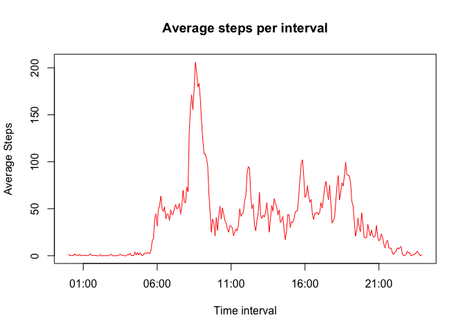
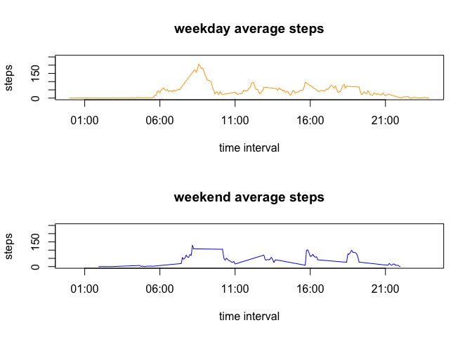

# Reproducible Research: Peer Assessment 1
##Introduction

It is now possible to collect a large amount of data about personal movement using activity monitoring devices such as a Fitbit, Nike Fuelband, or Jawbone Up. These type of devices are part of the “quantified self” movement – a group of enthusiasts who take measurements about themselves regularly to improve their health, to find patterns in their behavior, or because they are tech geeks. But these data remain under-utilized both because the raw data are hard to obtain and there is a lack of statistical methods and software for processing and interpreting the data.

This assignment makes use of data from a personal activity monitoring device. This device collects data at 5 minute intervals through out the day. The data consists of two months of data from an anonymous individual collected during the months of October and November, 2012 and include the number of steps taken in 5 minute intervals each day.


## Loading and preprocessing the data
**Note**: It is considered that you already have zip file loaded to your work repository.

```r
unzip("activity.zip")
activity<- read.csv("activity.csv", header = TRUE, sep = ',', colClasses = c("numeric", "character", "integer"))
```

## What is mean total number of steps taken per day?

1. Calculate the total number of the steps taken per day.

```r
    stepsPerDay <- aggregate(list(steps = activity$steps), list(date = activity$date), FUN = sum, na.rm = TRUE)
```

2. Make a histogram of the total number of steps taken each day.

```r
    Xbreaks <- seq(from = 0, to = 26000, by = 2000)
    hist(stepsPerDay$steps, breaks = Xbreaks, col = "red", main = "Steps per day", xlab = "Steps")
```

 

3. Calculate and report the mean and median of the total number of stepshis taken per day.

```r
    mean(stepsPerDay$steps, na.rm = TRUE)
```

```
## [1] 9354.23
```

```r
    median(stepsPerDay$steps, na.rm = TRUE)
```

```
## [1] 10395
```

## What is the average daily activity pattern?
1. Make a time series plot (i.e. type = "l") of the 5-minute interval (x-axis) and the average number of steps taken, averaged across all days (y-axis)


```r
# converting invervals to time
hours <- activity$interval %/% 100
hours <- ifelse(hours < 10, paste("0", hours, sep = ""), hours)

mins <- activity$interval %% 100
mins <- ifelse(mins < 10, paste("0", mins, sep = ""), mins)

time <- strptime(paste(hours,":", mins, sep = ""), format = "%H:%M" )
activity <- cbind(activity, time)

# plotting average steps per 5 mins interval

stepsPerInt <- aggregate(list(mnSteps = activity$steps), by = list(time = activity$time), FUN = mean, na.rm = TRUE)

plot(stepsPerInt$time, stepsPerInt$mnSteps, type = "l", col = "red", xlab = "Time interval", ylab = "Average Steps", main = "Average steps per interval")
```

 

2. Which 5-minute interval, on average across all the days in the dataset, contains the maximum number of steps?


```r
max(stepsPerInt$mnSteps)
```

```
## [1] 206.1698
```

```r
stepsPerInt$time[stepsPerInt$mnSteps == max(stepsPerInt$mnSteps)]
```

```
## [1] "2015-12-20 08:35:00 PST"
```
Highest average steps per interval is 206.2 and occurs on 8:35 time interval.

## Imputing missing values

Approach: we will replace missing values with a mean value for the same time interval.

1. Calculate total number of missing values.

```r
sum(is.na(activity$steps))
```

```
## [1] 2304
```

2. Calculating mean and creating new dataset with imputed values.

```r
# we already have mean by interval from previous chunk: stepsPerInt$mnSteps. Merging in a new dataset
Imp_activity <- merge(x = activity, y = stepsPerInt, by.x = "time", by.y = "time", all.x = TRUE)
Imp_activity$imp_steps<-ifelse(is.na(Imp_activity$steps), Imp_activity$mnSteps, Imp_activity$steps)
```

3. Plotting new historgram with imputed values. 

```r
# Replicating histogram from previous chunk (with missing values)
Imp_stepsPerDay <- aggregate(list(steps = Imp_activity$imp_steps), list(date = Imp_activity$date), FUN = sum, na.rm = TRUE)
Xbreaks <- seq(from = 0, to = 26000, by = 2000)
hist(Imp_stepsPerDay$steps, breaks = Xbreaks, col = "red", main = "Steps per day", xlab = "Steps")
```

 

4. Re-calculating mean and median with imputed values.

```r
mean(Imp_stepsPerDay$steps, na.rm = TRUE)
```

```
## [1] 10766.19
```

```r
median(Imp_stepsPerDay$steps, na.rm = TRUE)
```

```
## [1] 10766.19
```


## Are there differences in activity patterns between weekdays and weekends?

Make a panel plot containing a time series plot (i.e. type = "l") of the 5-minute interval (x-axis) and the average number of steps taken, averaged across all weekday days or weekend days (y-axis). 


```r
## Using Imp_activity dataset. Calculate weekdays and add weekday/weekend indicator
Imp_activity$weekday<-weekdays(strptime(paste(activity$date, " 00:00", sep = ""), format = "%Y-%m-%d %H:%M"))

Imp_activity$weekendInd <- ifelse(Imp_activity$weekday %in% c("Sunday", "Saturday"), "weekend", "weekday")

Imp_stepsPerIntWeek <- aggregate(Imp_activity$imp_steps, list(time = Imp_activity$time, weekendInd = Imp_activity$weekendInd), mean, na.rm = TRUE)

# creating separate datasets for weekday and weekends
weekday<-Imp_stepsPerIntWeek[Imp_stepsPerIntWeek$weekendInd == "weekday",]
weekend<-Imp_stepsPerIntWeek[Imp_stepsPerIntWeek$weekendInd == "weekend",]

## plotting

par(mfrow = c(2,1))

# to align axis
my.limits<-c(min(Imp_activity$time), max(Imp_activity$time))
my.limits<-as.numeric(my.limits)

# actual plots
plot(weekday$time, weekday$x, type = "l", col = "orange", main = "weekday average steps", xlab = "time interval", ylab = "steps", ylim = c(0,250) , xlim = my.limits )
plot(weekend$time, weekend$x, type = "l", col = "blue", main = "weekend average steps", xlab = "time interval", ylab = "steps", ylim = c(0,250), xlim = my.limits)
```

 

Looks like weekend activity is more evenly spread across a full day whereas weekday activity spikes around 8am and then slows down for the rest of the day. This might be explained by work time schedule of an average person.

